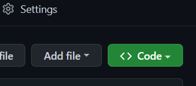
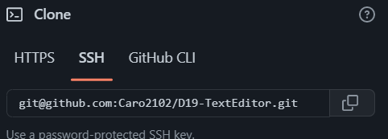
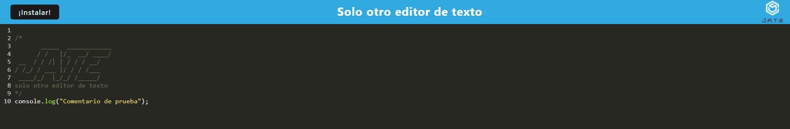
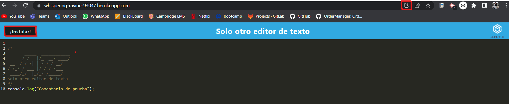
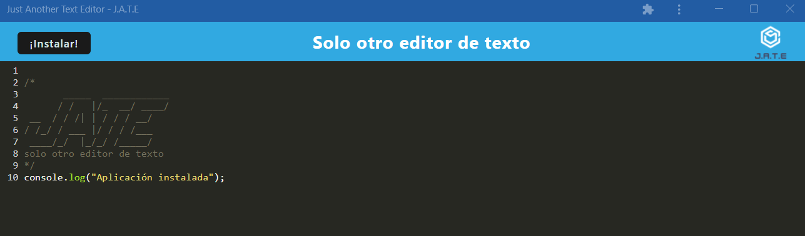
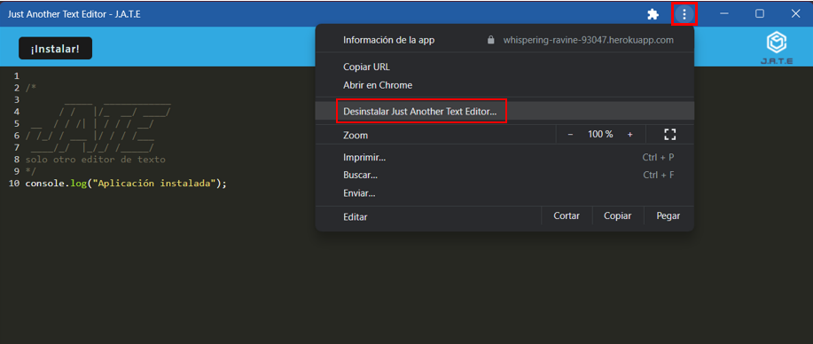

# D19-TextEditor
Editor de texto para crear notas o fragmentos de código con o sin conexión a Internet

---
  ## Contenido
  1. [Enlaces](#enlaces)
  2. [Tecnologias](#tecnologias)
  3. [Instalación](#instalación)
  4. [Uso](#uso)
  5. [Contribución](#contribución)
  
---
## Enlaces

**[Enlace con la aplicación desplegada en Heroku ](https://whispering-ravine-93047.herokuapp.com/  "click")**.

**[URL de repositorio de GitHub](https://github.com/Caro2102/D19-TextEditor "click")**.

---
## Tecnologias:
- General
    - node JS versión 16.18.0
    - npm express 4.17.1
    - npm if-env 1.0.4
    - npm concurrently 5.2.0
    - npm nodemon 2.0.4
    - HTML
    - Heroku
- Cliente
    - npm @babel/core 7.15.0
    - npm @babel/plugin-transform-runtime 7.15.0
    - npm @babel/preset-env 7.15.0
    - npm @babel/runtime 7.15.3
    - npm babel-loader 8.2.2
    - npm css-loader 6.2.0
    - npm html-webpack-plugin 5.3.2
    - npm http-server 0.11.1
    - npm style-loader 3.2.1
    - npm webpack 5.51.1
    - npm webpack-cli 4.8.0
    - npm webpack-dev-server 4.0.0
    - npm webpack-pwa-manifest 4.3.0
    - npm workbox-webpack-plugin 6.2.4
    - npm code-mirror-themes 1.0.0
    - npm idb 6.1.2
- Servidor
    - npm express 4.17.1
    - npm nodemon 2.0.4

---
  ## Instalación
- Clonar repositorio
    - Abrir el siguiente link **[URL de repositorio de GitHub](https://github.com/Caro2102/D19-TextEditor "click")**.
    - Hacer click en <> Code.

        
    - Copiar la direccion URL del repositorio.

        
    - Abrir GitBash.
    - Ir a la ubicacion en donde quieres clonar el repositorio.
    - Escribir **`git clone`** y pegar la url antes copiada.
    - Presionar enter para clonar.
    - Instalar node desde la pagina oficial **[NodeJS web Oficial](https://nodejs.org/es/ "click")**.
    - Abrir GitBash.
    - Ir a la ubicacion en donde se clonó el repositorio.
    - Escribir **`npm run install`** para instalar todas las dependencias del proyecto.
        - Con esto instalaremos todas las dependecias que tengamos en los package.json tanto general, cliente y servidor y nos creará carpetas llamadas **node_modules** con las dependencias listas para utilizar.
    - Escribir **`npm start`** para ejecutar el archivo.

---
## Uso
1. Despues de seguir los pasos de [Instalación](#instalación) y haber ejecutado el programa ó ingresado desde la aplicación en **[Heroku ](https://whispering-ravine-93047.herokuapp.com/  "click")**.
2. La aplicación se verá de esta manera.
    

    - Para guardar el contenido del editor de texto, hacer clic fuera de la ventana del navegador.
    - Cuando vuelva a abrir el editor de texto después de cerrarlo, el contenido se habrá recuperado.
3. Para instalar la aplicación web como icono en mi escritorio es necesario dar click en el botón **`instalar`** o dar click en el icono que esta en la barra de navegación que se muestra en la siguiente imagen
    
    
    - Una vez confirmada la instalación, la aplicación se verá de la siguiente forma en una ventana y estará en una ventana en la barra de tareas.

    

    - Para desinstalar la app:

    

---
## Contribución:
    
  Para contribuir con este proyecto:
- Fork del repositorio.
- Clonar el  repositorio.
- Actualizar la rama master.

        $git pull -r upstream master
- Crear rama.

        $ git checkout -b feature-nombre-rama
- Realizar cambios, agregarlos, hacer commit y despues hacer push hacia nuestro repositorio indicando la rama que hemos creado.

        $ git push origin feature-nombre-rama
- Hacer un Pull Request.
- Esperar que el codigo se acepte y se haga merge.

